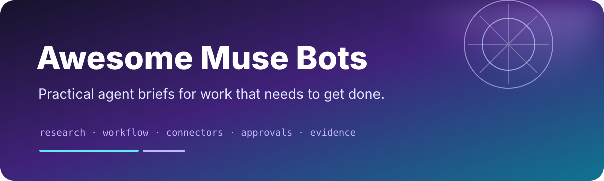

# Awesome Muse Bots

> A curated collection of practical, copy-paste Muse agent briefs for research, productivity, operations, content, engineering, and personal workflows.

Muse is Meta's personal AI agent. Its official product page describes an agent that can browse the web, use connected apps, create documents and images, set reminders, track goals, monitor information in the background, and ask for approval before sensitive actions. This repository turns those capabilities into focused, reusable bot briefs.

This is an independent community collection. It is not affiliated with, endorsed by, or operated by Meta.

## Related Projects

- [Awesome Jev by TypeSafe](https://github.com/Anil-matcha/awesome-jev-by-typesafe) — typed, confidence-aware decision workflows.
- [Awesome Grok Bot](https://github.com/Anil-matcha/awesome-grok-bot) — copy-paste bot briefs for persistent AI teammates.
- [Awesome GPT-6 Astra](https://github.com/Anil-matcha/awesome-gpt-6-astra) — evidence-backed model use cases, prompts, and evaluations.
- [Open Grok Bot](https://github.com/Anil-matcha/open-grok-bot) — local-first bot-persona workspace with approvals and audit trails.
- [Awesome OpenClaw](https://github.com/Anil-matcha/awesome-openclaw) — self-hosted agent resources, skills, and integrations.
- [Awesome Hermes Agent](https://github.com/Anil-matcha/awesome-hermes-agent) — agent workflows and creator-focused automation resources.
- [MuseBot](https://github.com/yincongcyincong/MuseBot) — a separate open-source, multi-platform chatbot implementation.

## How to use a template

1. Open Muse in the [Muse app](https://ai.meta.com/muse/download/), WhatsApp, or at [muse.ai](https://muse.ai/).
2. Start a new conversation and copy the prompt from one of the templates below.
3. Paste it into Muse and answer its setup questions.
4. Connect only the apps the workflow needs.
5. Run the first task under supervision. Keep approval required for sending, purchasing, deleting, publishing, or sharing.

Templates are starting points, not unattended automation recipes. Replace bracketed fields, narrow the scope, and tell Muse what it must never do without your approval.

## Contents

| Area | Templates |
|---|---|
| Personal workflow | [Chief of Staff](templates/chief-of-staff.md) · [Goal Tracker](templates/goal-tracker.md) |
| Research and knowledge | [Research Brief](templates/research-brief.md) · [Competitive Watch](templates/competitive-watch.md) |
| Communication and operations | [Inbox Triage](templates/inbox-triage.md) · [Customer Ops Triage](templates/customer-ops-triage.md) |
| Travel and money | [Travel Planner](templates/travel-planner.md) · [Subscription Auditor](templates/subscription-auditor.md) |
| Creative and files | [Content Studio](templates/content-studio.md) · [Document Librarian](templates/document-librarian.md) |
| Engineering and safety | [GitHub Release Manager](templates/github-release-manager.md) · [Permission Auditor](templates/permission-auditor.md) |

## Template contract

Every template should make five things explicit:

- **Goal:** the outcome the bot owns.
- **Inputs:** the connected apps, files, or facts it may use.
- **Output:** the format of the result, including links or evidence where possible.
- **Approval boundary:** what requires a yes before it happens.
- **Stop condition:** when it should pause, ask a question, or hand control back.

The best Muse bots are narrow enough to verify and useful enough to run repeatedly. Prefer a clear finish line over a vague “do everything” persona.

## Safety defaults

- Do not send messages, make purchases, publish content, delete files, change permissions, or submit forms without explicit approval.
- Treat email, calendars, files, credentials, financial data, health information, and private conversations as sensitive.
- Ask before acting when a request is ambiguous, irreversible, expensive, regulated, or affects another person.
- Keep an audit-friendly record of sources, decisions, actions, and unresolved uncertainty.
- Never paste API keys, passwords, access tokens, or private customer data into a public issue or pull request.

For high-impact decisions, use Muse to organize evidence and prepare options, then make the decision yourself or through the appropriate human process.

## Official context

| Topic | Source |
|---|---|
| Muse capabilities and connectors | [Meta: Muse features](https://ai.meta.com/muse/) |
| Apps and desktop access | [Meta: Download Muse](https://ai.meta.com/muse/download/) |
| Product launch, permissions, audit trail, and secure VM | [Meta Newsroom: Introducing Muse](https://about.fb.com/news/2026/09/introducing-muse-personal-ai-agent/) |
| Agentic AI task design | [Meta: What is agentic AI?](https://ai.meta.com/learn/agentic-ai/what-is-agentic-ai/) |

Official behavior, availability, limits, and connected-app support can change. Re-check the linked sources before relying on a capability in production.

## Contributing

Pull requests are welcome. Add one focused template under [`templates/`](templates/) using the format in [CONTRIBUTING.md](CONTRIBUTING.md). Include the original creator or source when a prompt is adapted, keep permissions explicit, and test the first run before describing a workflow as ready to use.

## License

MIT. See [LICENSE](LICENSE).

Maintained by [Anil Chandra Naidu Matcha](https://github.com/Anil-matcha).
